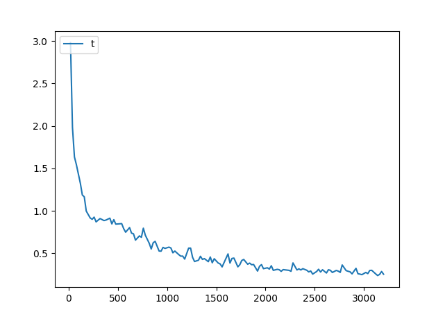
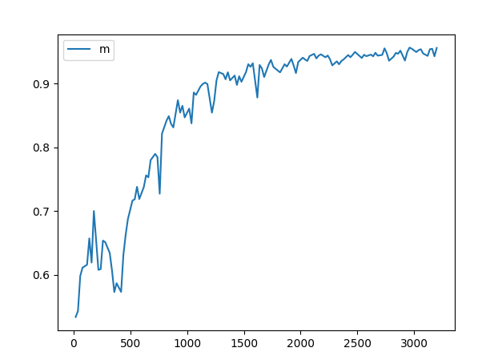

# Модель для обнаружения посторонних и негабаритных предметов

## Использованная модель 

За основу была взята модель mask_rcnn_X_101_32x8d_FPN_3x. Созданная модель была обучена на датасете из 400 изображений, на которых присутствовали следующие классы:

- Дерево
- Негабаритные камни
- Пластик

Модель была обучена в 3200 итераций.

Loss:

Accuracy:

## Использованные технологии

Программа, использующая данную модель была разработана на основе клиент-серверной архитектуры.

Клиентская часть написана на C# с использованием фреймовкрка WPF и .NET  5.0. Серверная часть написана на Python 3 и использует для своей работы бибилиотеки Detectron2 и OpenCV. В качестве СУБД сервера используется SQLite. Взаимодействие между клиентом и сервером осуществялется посредством отправки JSON-файлов через HTTP.